# Temat: Eksploracja połączeń między fraktalami, a naturą przy pomocy "Krzywej Smoka"

Myślę, że niektórzy odbiorcy mojego projektu mogą nie wiedzieć, co to jest fraktal w ogóle, więc przedstawię krótką jego definicję:

- **Fraktal** <- oznacza zwykle obiekt samopodobny (obiekt jest samopodobny, jeżeli jego pewne elementy są podobne do całości) albo "nieskończenie złożony, czyli ukazujący coraz większe detale. Ze względu na ich różnorodność, unika się podawania jakiejkolwiek ścisłej definicji, a obiekt można nazwać fraktalem, jeżeli spełnia wszystkie lub większość tych cech:
    - Ma skomplikowaną strukturę w każdej skali
    - Struktura ta nie jest łatwa do opisania w jeżyku tradycyjnej geometrii euklidesowej,
    - Jest samopodobny, jeżeli nie dosłownie, to w wersji przybliżonej lub stochastycznej,
    - Ma względnie prostą definicję rekurencyjną,
    - Ma naturalny ("poszarpany", "kłębiasty" itp.) wygląd.

To delikatnie skrócona wersja definicji fraktala, ale dzięki niej możemy już przejść do definicji krzywej smoka:

- **Krzywa smoka** <- jest to członek rodziny samopodobnych krzywych fraktalnych, które można „aprokysmować” (inaczej oszacować) za pomocą metody rekursyjnych takich jak system Lindenmayera. Krzywą smoka najczęściej uważano prawdopodobnie za krzstałt, który jest generowany poprzez powtarzalne składanie paska papieru na pół.

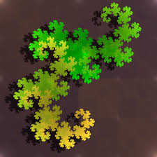 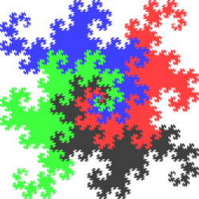

*(Więcej o krzywej smoka i jej stwórcach można poczytać [tutaj](https://en.wikipedia.org/wiki/Dragon_curve) oraz [tutaj](https://pl.wikipedia.org/wiki/Smok_Heighwaya))*

A my za to przejdziemy już do samego problemu badawczego, czyli eksploracji połączeń między naturą, a fraktalami i co do tego ma krzywa smoka???

## Opis problemu badawczego

Na co dzień jest to logiczne, że wokół nas jest pełno mniej lub bardziej fascynującej przyrody. Mam na myśli tutaj chociażby: wielokolorowe drzewa podczas jesieni, różnorodne kształty liści, postawanie różnorodnych i interesujących kształt chmur i wiele, wiele więcej. Wiele tych rzeczy jest często ułożonych w nienaturalne kształty, są w pewnych momentach podobne/powtarzalne, raczej żadne rzeczy w naturze nie mają "trywialnych" struktur i porównując te cechy do cech, jakie ma posiadać obiekt, żeby być "fraktalem" to od razu możemy "połączyć kropki" i stwierdzić, że niejako "otaczają nas fraktale"!😄

Dla potwierdzenia problemu badawczego można przedstawić kilka przykładów w przyrodzie:

1. **Liście i rośliny**
- Struktura liści wielu roślin może przypominać wzory fraktalne, takie jak krzywa smoka. Kiedy liście rozwijają się w sposób spiralny lub mają złożone krawędzie, mogą one tworzyć wzory przypominające fraktale.

 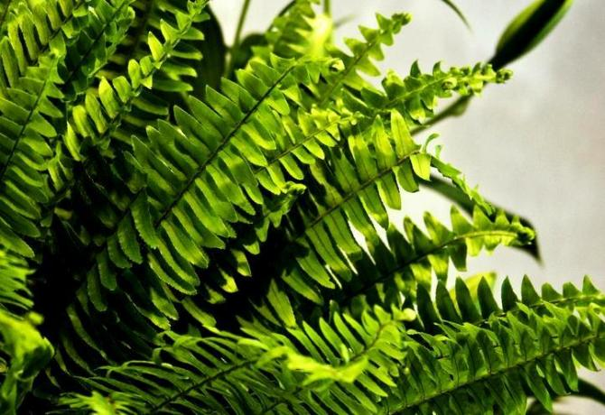

2. **Formacje skalne**
- Pewne formacje skalne, szczególnie te, które powstają w wyniku erozji lub działania sił tektonicznych, mogą tworzyć złożone, samo-podobne wzory przypominające krzywą smoka. Przykładem mogą być niektóre skalne wybrzeża lub kaniony.

 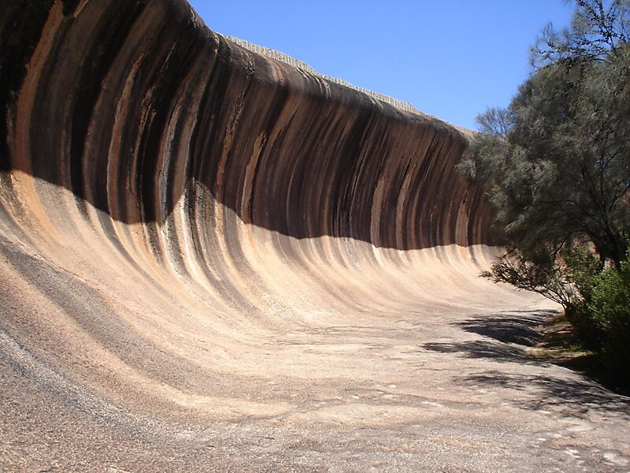

3. **Układy chmur**
- Formacje chmur, zwłaszcza te, które powstają w wyniku turbulencji, mogą tworzyć fraktalne wzory. Często widać to w chmurach burzowych lub w układach chmur cirrus, gdzie kształty przypominają złożone krzywe fraktalne.

 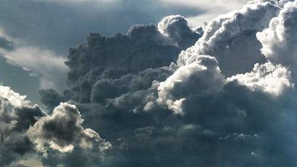

4. **Układy korzeni**
- Systemy korzeniowe wielu roślin, szczególnie tych, które rozrastają się w nieregularny sposób w poszukiwaniu wody i składników odżywczych, mogą tworzyć fraktalne wzory. Te wzory mogą przypominać złożone kształty podobne do krzywej smoka.

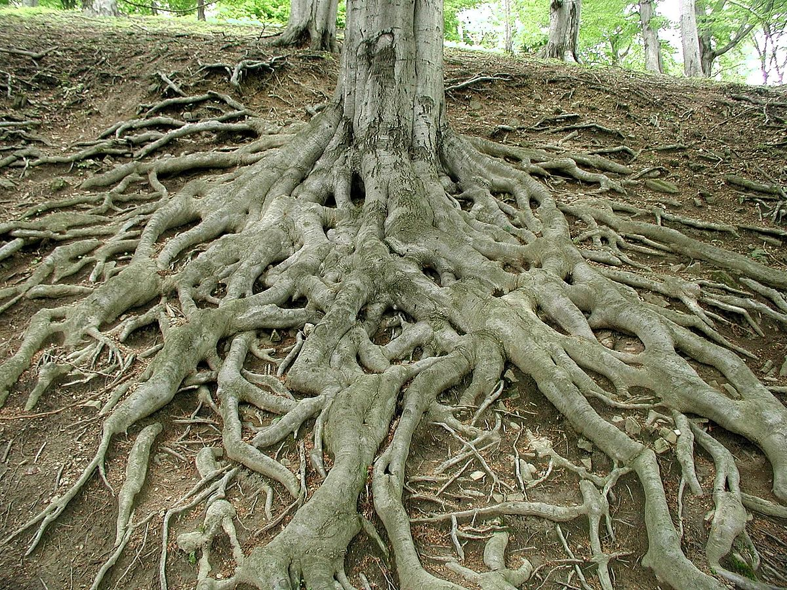 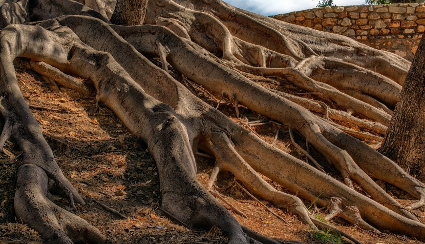

5. **Pola magnetyczne i linie sił**
- Linie sił pola magnetycznego wokół magnesów lub w ziemskim polu magnetycznym mogą tworzyć skomplikowane, fraktalne wzory, które przypominają krzywą smoka.

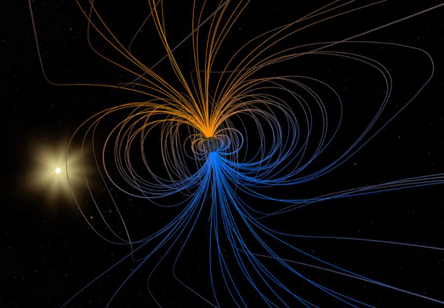 

## Rozwiązanie problemu

Program, który napisałem, generujący nam wspomnianą "krzywą smoka" polega na prostym zobrazowaniu, jak wygląda "krzywa smoka" na różnych jej etapach rozwoju, ponieważ poprzez plik "config.txt" dostępnym na moim repozytorium można wybrać, ile iteracji "krzywej smoka" chcemy zobaczyć **(UWAGA! Dla iteracji większej niż 13, program nie generuje już dalej krzywej smoka w postaci graficznej!)** na ekranie. Jeżeli chodzi o parametry programu, to możemy kontrolować je za pomocą edycji pliku "config.txt", a w nim dane do edycji to: ilość iteracji, szerokość pliku graficznego, wysokość pliku graficznego oraz długość kroku. Zmiany wszystkich tych wartości sprawia, że symulacja oraz graficzna reprezentacja owej symulacji jest różna, w zależności właśnie od podanych wartości. Przyjazny jest ten program również dla użytkownika, ponieważ jest wiele możliwości modyfikacji (np. oparcie go o tablice, zamiast struktury czy wykorzystanie innej biblioteki do generowania graficznego efektu działania programu).

## Przykład użycia programu ukazany przez zrzuty ekranu

**(Wszystko było robione na ustawieniach pliku "config.txt": iter - 10, width - 1200, height - 1200, step - 10)**

<ins>DLA WYBRANIA OPCJI GENEROWANIA GRAFICZNEGO EFEKTU DZIAŁANIA PROGRAMU:<ins>

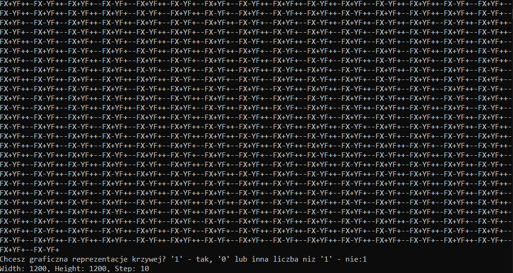 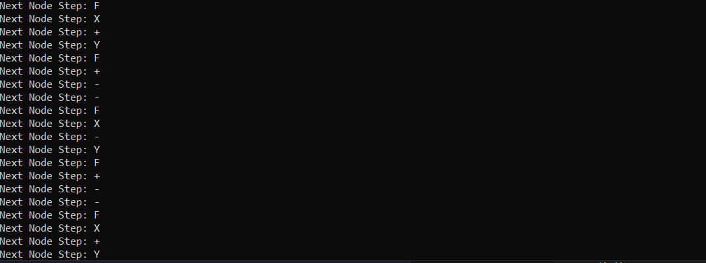 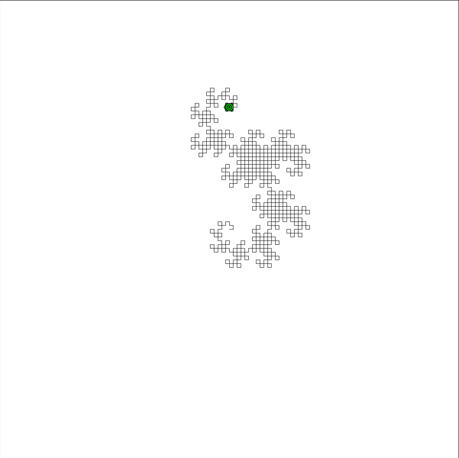

<ins>DLA NIE WYBRANIA OPCJI GENEROWANIA GRAFICZNEGO EFEKTU DZIAŁANIA PROGRAMU:<ins>

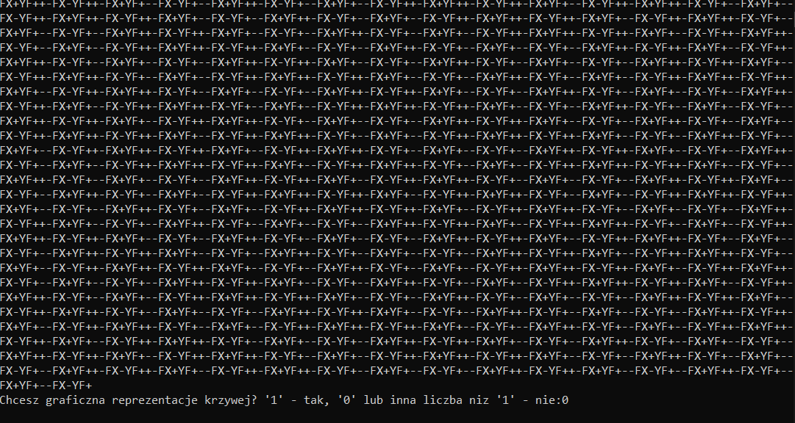 

## Dodatkowe biblioteki

- ***"turtle.h"** oraz plik do niej **"turtle.c"*** - Jedyna dodatkowa biblioteka dołączona do tego programu, która odpowiada za wspomnianą już nieraz w dokumentacji, generacji graficznego efektu działania programu za pomocą żółwika 🐢 rysującego "krzywą smoka".

## Jak skompilować poprawnie program?

**(UWAGA! Wszystkie operacje kompilacji programu wykonywałem na kompilatorze *<ins>"gcc"<ins>* na systemie operacyjnym *<ins>"Windows 10"<ins>*, ale dla każdego systemu operacyjnego, jeżeli będziemy używać kompilatora *<ins>"gcc"<ins>* wszystko powinno działać poprawnie!)**

1. Pobrać wszystkie pliki z repozytorium i wrzucenie ich do tego samego folderu.

1. Użyć w konsoli komendy *(będąc w lokalizacji/folderze, gdzie pobraliśmy wszystkie pliki do tego programu)*: ***gcc -Wall -Wextra .\krzywa_smoka.c .\turtle.c*** do sprawdzenia, czy program kompiluje się bez żadnych błędów ani ostrzeżeń. Jeżeli wystąpią jakieś problemy, to oznacza, że coś jest nie tak po stronie użytkownika (np. różna lokalizacja plików).

1. Używając konsoli oraz będąc w lokalizacji/folderze z wszystkimi plikami z repozytorium użyć komendy: ***gcc .\krzywa_smoka.c .\turtle.c -o nazwa_outputu*** *(UWAGA! Opcja '-o nazwa_outputu' jest opcjonalna. Jeżeli jej nie użyjemy, to domyślny plik wykonywalny będzie nazywać się "a.exe")*.

1. Dalej będąc w konsoli *(oraz nie zmieniając lokalizacji/folderu!)* użyć komendy: ***.\nazwa_outputu.exe*** (albo ***.\a.exe***, jeżeli nie użyliśmy opcji ***-o nazwa_output***!).

1. PODZIWIAĆ DZIAŁANIE PROGRAMU!!!😎

## Źródła wszystkich obrazów czy opisów:
- Google Grafika

- Wikipedia (https://en.wikipedia.org/wiki/Dragon_curve, https://pl.wikipedia.org/wiki/Smok_Heighwaya, https://pl.wikipedia.org/wiki/Fraktal)

- https://www.mscroggs.co.uk/blog/26 <- Dlaczego "krzywa smoka" nazywamy "krzywą smoka"
